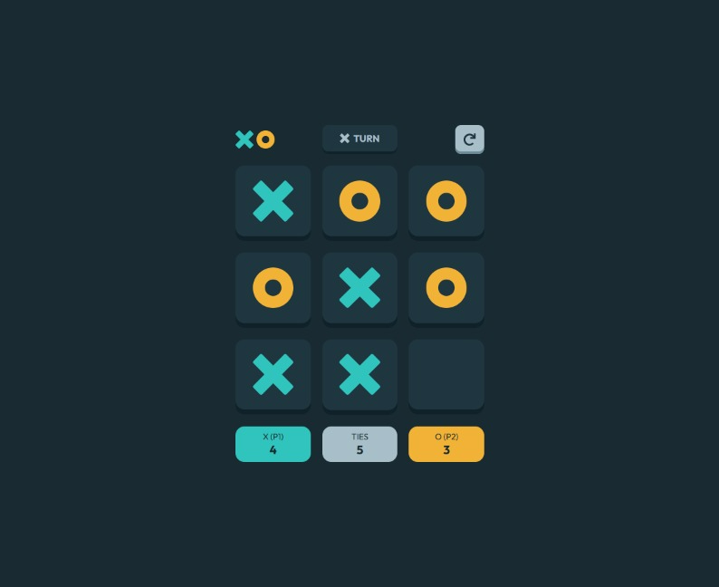

# Frontend Mentor - Tic Tac Toe solution

This is a solution to the [Tic Tac Toe challenge on Frontend Mentor](https://www.frontendmentor.io/challenges/tic-tac-toe-game-Re7ZF_E2v). Frontend Mentor challenges help you improve your coding skills by building realistic projects. 

## Table of contents

- [Frontend Mentor - Tic Tac Toe solution](#frontend-mentor---tic-tac-toe-solution)
  - [Table of contents](#table-of-contents)
  - [Overview](#overview)
    - [The challenge](#the-challenge)
    - [Screenshot](#screenshot)
    - [Links](#links)
  - [My process](#my-process)
    - [Built with](#built-with)
    - [What I learned](#what-i-learned)
    - [Continued development](#continued-development)
    - [Useful resources](#useful-resources)
  - [Author](#author)

## Overview

### The challenge

Users should be able to:

- View the optimal layout for the game depending on their device's screen size
- See hover states for all interactive elements on the page
- Play the game either solo vs the computer or multiplayer against another person
- **Bonus 1**: Save the game state in the browser so that it’s preserved if the player refreshes their browser
- **Bonus 2**: Instead of having the computer randomly make their moves, try making it clever so it’s proactive in blocking your moves and trying to win

### Screenshot

### Links

- Solution URL: [Solution](https://www.frontendmentor.io/solutions/tic-tac-toe-ai-challenge-react-typescript-and-minimax-algorithm-og2WzCSdtP)
- Live Site URL: [Tic Tac Toe](https://webguy83.github.io/tic-tac-toe-react/)

## My process

### Built with

- Semantic HTML5 markup
- CSS custom properties
- Flexbox
- CSS Grid
- TypeScript
- [React](https://react.dev/) - JS library

### What I learned

During the Tic Tac Toe project, I developed a deeper understanding of the minimax algorithm and its application in creating a challenging CPU opponent. The minimax algorithm is an essential tool in game theory and artificial intelligence, used to evaluate potential game states and determine the best possible move for the CPU. By implementing this algorithm, I learned how to construct a game logic that can effectively anticipate and counter the player's moves, making the gameplay more competitive and engaging. This project provided valuable experience in integrating AI strategies into game development and refining my problem-solving skills to enhance the overall gaming experience.

### Continued development

In future projects, I aim to leverage the insights gained from this challenge to build more complex games and further explore advanced coding practices and AI algorithms. I plan to investigate deeper into artificial intelligence techniques, such as neural networks and reinforcement learning, to develop more sophisticated game logic. Additionally, I intend to continue improving my proficiency in modern web development frameworks and tools, ensuring I stay updated with the latest industry trends. This project has set a foundation for me to pursue more ambitious game development tasks and continually improve my technical capabilities.

### Useful resources

- [Minimax Algorithm](https://www.freecodecamp.org/news/minimax-algorithm-guide-how-to-create-an-unbeatable-ai/) - Making the CPU intelligent

## Author

- Github - [Github](https://github.com/webguy83)
- Frontend Mentor - [@yourusername](https://www.frontendmentor.io/profile/webguy83)
- Instagram - [@canadianwebdev83](https://www.instagram.com/canadianwebdev83/)